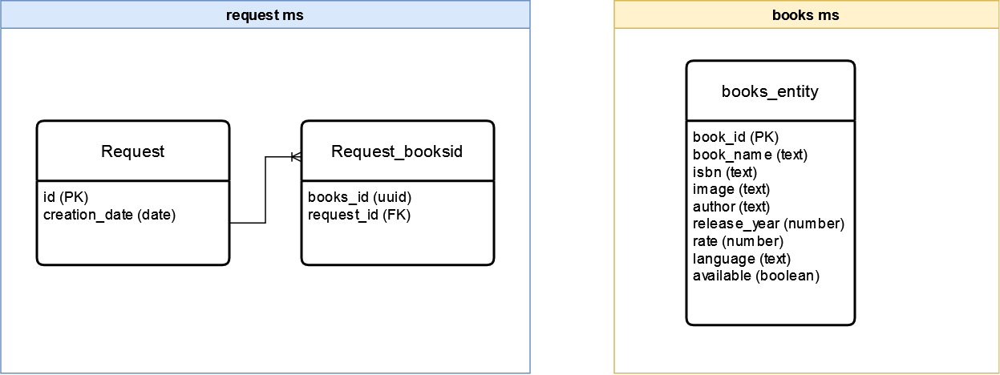

# README para el Proyecto UNIR Bookshop

## Descripción General
UNIR Shop es un sistema de gestión de pedidos y compras de libros implementado como un conjunto de microservicios. Cada microservicio se encarga de una parte específica de la funcionalidad del sistema, como la gestión de libros, solicitudes y el servicio de pasarela.

## Microservicios
El proyecto se compone de los siguientes microservicios:
- **Requests**: Gestión de solicitudes de libros.
- **Eureka**: Servicio de descubrimiento de Eureka.
- **Gateway**: Servicio de puerta de enlace.
- **Books**: Gestión de libros.

## Dependencias Principales
- Spring Boot Starter Parent 3.2.0
- Spring Cloud 2023.0.0
- Springdoc OpenAPI Web MVC UI 2.2.0

## Configuración
Se proporcionan dos archivos de configuración YAML para los microservicios de `requests` y `books`:

### Requests Service (Puerto 8081)
- Base de datos H2 en memoria.
- Registro en Eureka Service Discovery.

### Books Service (Puerto 8082)
- Base de datos H2 en memoria.
- Registro en Eureka Service Discovery.

## Hitos Clave

### Funcionalidades del Servicio de Libros (Puerto 8082)
- **Libros Filtrados**: Filtrar libros por autor y nombre. (`GET /api/v1/books/filterBy`)
- **Todos los Libros**: Listar todos los libros disponibles. (`GET /api/v1/books/all`)
- **Verificar Carrito de Compras**: Verificar los libros en el carrito de compras. (`POST /api/v1/books/verify`)
- **Compra**: Realizar una solicitud de compra de libros. (`POST /api/v1/books/request`)
- **Cambiar Disponibilidad de Libros**: Cambiar la disponibilidad de los libros. (`POST /api/v1/books/changeAvailability`)
- Documentación API: Disponible a través de OpenAPI en `http://127.0.0.1:8082/v3/api-docs`.

### Funcionalidades del Servicio de Solicitudes (Puerto 8081)
- **Todas las Solicitudes**: Listar todas las solicitudes.
- **HealthCheck de Solicitudes**: Verificar el estado del servicio de solicitudes.
- **Crear Petición de Libros**: Enviar una nueva petición de libros.
- **Eliminar Solicitud de Libros**: Eliminar una solicitud de libros existente. (`DELETE /api/v1/requests?requestUUID={uuid}`)
- Documentación API: Disponible a través de OpenAPI en `http://127.0.0.1:8081/v3/api-docs`.

## Documentación API con Swagger
La documentación de la API para ambos servicios está disponible a través de Swagger UI:
- Para el servicio de libros (Books Service): `http://127.0.0.1:8082/swagger-ui/index.html`
- Para el servicio de solicitudes (Requests Service): `http://127.0.0.1:8081/swagger-ui/index.html`

## Instrucciones de Instalación y Ejecución
1. Clonar el repositorio desde GitHub.
2. Asegurarse de tener Maven y Java instalados.
3. Ejecutar cada microservicio usando Maven, por ejemplo: `mvn spring-boot:run` en cada directorio de microservicio.
4. Acceder a la interfaz de Swagger para interactuar con la API.

## Detalles

### Modelo

## Contribuciones
Las contribuciones al proyecto son bienvenidas despues de la entrega ya que es necesario que para la calificacion unicamente los participantes del grupo colaboren. Se sugiere seguir las prácticas comunes de desarrollo colaborativo utilizando GitHub (forks, pull requests, issues).

---
